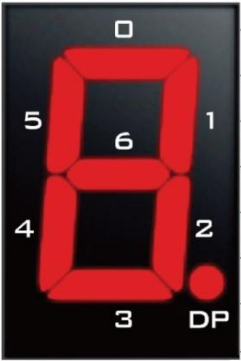
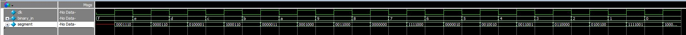

# Binary to 7-Segment

The 7-segment decoder is used  to translate a 4-bit binary value into the 7 outputs required to display it on a 7-segment display. The purpose of it here is to aid in testing of the VGA, UART Tx, and UART Rx modules.

## DE-10 Lite Pinout

Present on the DE-10 Lite are six 7-segment displays. The figure and table below show the pinout for the 7-segment displays on the DE-10 Lite. The segments are active low, meaning that a segment will light up when its corresponding output is low.

{width=150px}
/// caption
Each segment in a display is indexed from 0 to 6 and DP (decimal point)
///

Here we will be focusing on the first two 7-segment displays, which are connected to the following pins on the DE-10 Lite:

=== "7-Segment Digit 0"

    | Segment | DE-10 Lite Pin |
    |---------|-----------------|
    | 0       | PIN_C14         |
    | 1       | PIN_E15         |
    | 2       | PIN_C15         |
    | 3       | PIN_C16         |
    | 4       | PIN_E16         |
    | 5       | PIN_D17         |
    | 6       | PIN_C17         |
    | DP      | PIN_D15         |

=== "7-Segment Digit 1"

    | Segment | DE-10 Lite Pin |
    |---------|-----------------|
    | 0       | PIN_C18         |
    | 1       | PIN_D18         |
    | 2       | PIN_E18         |
    | 3       | PIN_B16         |
    | 4       | PIN_A17         |
    | 5       | PIN_A18         |
    | 6       | PIN_B17         |
    | DP      | PIN_A16         |

## binary_to_7seg.v

### Module I/O

| Name       | Direction | Description                                                                   |
|------------|-----------|-------------------------------------------------------------------------------|
| `clk`      | Input     | Clock signal for sequential logic                                             |
| `binary_in`| Input     | 4-bit binary input to be converted                                            |
| `segment`  | Output    | 7-bit output for the segments of the 7-segment display (0-6 on the DE10 Lite) |

### Verilog

The `binary_to_7seg` module takes a 4-bit binary input and converts it to the corresponding 7-segment display output. The segments are active low, so the output is inverted before being sent to the display.

``` verilog
module binary_to_7seg (
    // Inputs
    input        clk,            // Clock signal for sequential logic (if needed)
    input  [3:0] binary_in,     // 4-bit binary input to be converted

    // Outputs
    output reg [6:0] segment // Segments of the 7-segment display active-low (0-6 on the DE-10 Lite) 
);

// Clocked process to convert binary input to 7-segment output
always @(posedge clk) begin
// always @(*) begin
    case (binary_in)
        4'b0000: segment = 7'b1000000; // 0
        4'b0001: segment = 7'b1111001; // 1
        4'b0010: segment = 7'b0100100; // 2
        4'b0011: segment = 7'b0110000; // 3
        4'b0100: segment = 7'b0011001; // 4
        4'b0101: segment = 7'b0010010; // 5
        4'b0110: segment = 7'b0000010; // 6
        4'b0111: segment = 7'b1111000; // 7
        4'b1000: segment = 7'b0000000; // 8
        4'b1001: segment = 7'b0011000; // 9
        4'b1010: segment = 7'b0001000; // A
        4'b1011: segment = 7'b0000011; // B
        4'b1100: segment = 7'b1000110; // C
        4'b1101: segment = 7'b0100001; // D
        4'b1110: segment = 7'b0000110; // E
        4'b1111: segment = 7'b0001110; // F
        default: segment = 7'b1111111; // Blank for invalid input
    endcase
end

endmodule
```

## Testing

Testing of the `binary_to_7seg` module can be done using a simple testbench that applies various 4-bit binary inputs and checks the corresponding 7-segment outputs. The testbench can be implemented in SystemVerilog as follows:

### binary_to_7seg_tb.sv

``` systemverilog
module binary_to_7seg_tb;
    reg clk;
    reg [3:0] binary_in;
    wire [6:0] segment;

    // Instantiate the binary to 7-segment converter
    binary_to_7seg uut (
        .clk(clk),
        .binary_in(binary_in),
        .segment(segment)
    );

    // Clock generation
    initial begin
        clk = 0;
        forever #5 clk = ~clk; // 100 MHz clock
    end

    logic [3:0] test_inputs [15:0] = '{4'b0000, 4'b0001, 4'b0010, 4'b0011, 4'b0100, 4'b0101, 4'b0110, 4'b0111,
                          4'b1000, 4'b1001, 4'b1010, 4'b1011, 4'b1100, 4'b1101, 4'b1110, 4'b1111};

    logic [6:0] test_outputs [15:0] = '{7'b1000000, 7'b1111001, 7'b0100100, 7'b0110000, 7'b0011001, 7'b0010010, 7'b0000010, 7'b1111000,
                          7'b0000000, 7'b0011000, 7'b0001000, 7'b0000011, 7'b1000110, 7'b0100001, 7'b0000110, 7'b0001110};

    // Test sequence
    initial begin
        // Test all possible 4-bit inputs (0 to 15)
        for (int i = 0; i < 16; i = i + 1) begin
            binary_in = test_inputs[i]; 
            #10; // Wait for the output to stabilize
            // Check if the output matches the expected value $error("Test failed for input %b: expected %b, got %b", binary_in, test_outputs[i], segment);
            if (segment !== test_outputs[i]) begin
                $error("Test failed for input %b: expected %b, got %b", binary_in, test_outputs[i], segment);
            end else begin
                $display("Test passed for input %b: got expected output %b", binary_in, segment);
            end
        end
        
        $stop; // End the simulation
    end
endmodule
```

### Running the Testbench

To run the testbench I used QuestaSim. Below is the transcript and waveform of the testbench output, showing the results of each test case:


/// caption
An image of the waveform, showing the clock, binary input, and 7-segment output for each test case.
///

```
run -all
# Test passed for input 1111: got expected output 0001110
# Test passed for input 1110: got expected output 0000110
# Test passed for input 1101: got expected output 0100001
# Test passed for input 1100: got expected output 1000110
# Test passed for input 1011: got expected output 0000011
# Test passed for input 1010: got expected output 0001000
# Test passed for input 1001: got expected output 0011000
# Test passed for input 1000: got expected output 0000000
# Test passed for input 0111: got expected output 1111000
# Test passed for input 0110: got expected output 0000010
# Test passed for input 0101: got expected output 0010010
# Test passed for input 0100: got expected output 0011001
# Test passed for input 0011: got expected output 0110000
# Test passed for input 0010: got expected output 0100100
# Test passed for input 0001: got expected output 1111001
# Test passed for input 0000: got expected output 1000000
# ** Note: $stop    : C:/Users/lrwon/Documents/DE10-Lite-NES/tests/binary_to_7seg_tb.sv(39)
#    Time: 160 ns  Iteration: 0  Instance: /binary_to_7seg_tb
# Break in Module binary_to_7seg_tb at C:/Users/lrwon/Documents/DE10-Lite-NES/tests/binary_to_7seg_tb.sv line 39
```
